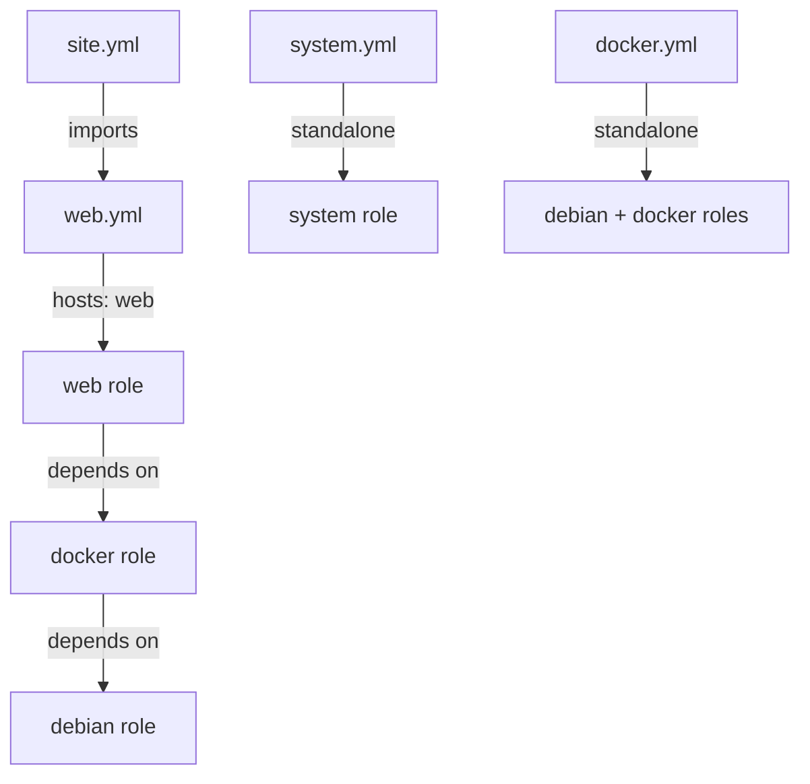
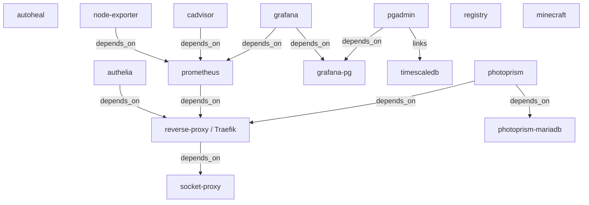
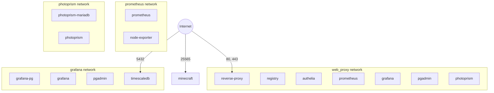
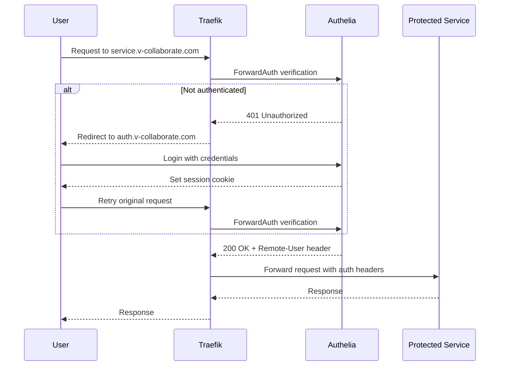
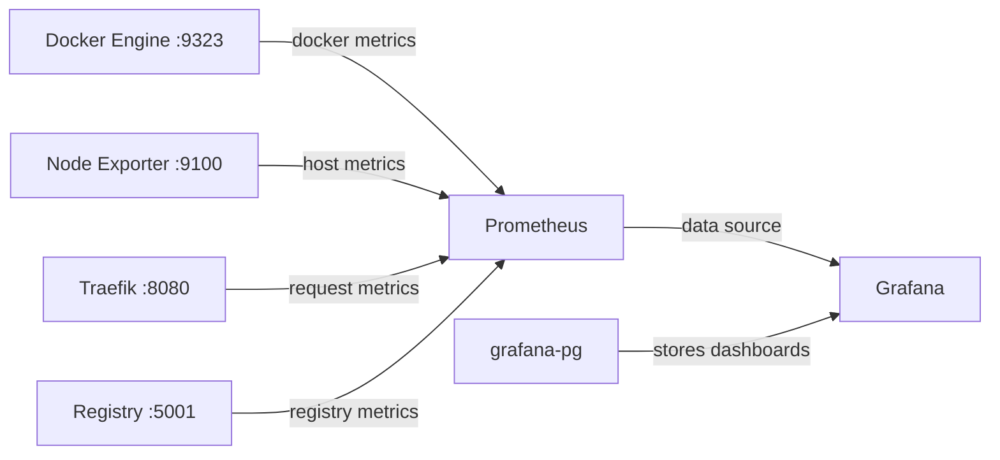

# Architecture

This document describes the architecture of the Ansible-based Docker server provisioning project. The project automates the setup of a Debian server, installs Docker, and deploys 15 containerized services via docker-compose.

## Table of Contents

- [Overview](#overview)
- [Ansible Structure](#ansible-structure)
- [Server Provisioning](#server-provisioning)
- [Docker Services](#docker-services)
- [Network Architecture](#network-architecture)
- [Reverse Proxy and Authentication](#reverse-proxy-and-authentication)
- [Monitoring Stack](#monitoring-stack)
- [Data Persistence](#data-persistence)
- [Backup and Maintenance](#backup-and-maintenance)
- [Security](#security)
- [Hosting Requirements and Migration](#hosting-requirements-and-migration)

---

## Overview

This project provisions a dedicated Debian server hosted at IONOS and deploys a full-stack application environment using Docker containers. The infrastructure is managed entirely through Ansible playbooks, with sensitive data protected by Ansible Vault.

The server runs 15 Docker containers providing:

- **Reverse proxy and TLS termination** via Traefik with automatic Let's Encrypt certificates
- **Authentication and SSO** via Authelia
- **Monitoring and dashboarding** via Prometheus, Node Exporter, and Grafana
- **Database services** including PostgreSQL, TimescaleDB, and MariaDB
- **Application services** including a private Docker registry, PhotoPrism photo management, pgAdmin, and a Minecraft game server

All web-facing services are accessible through subdomains of `v-collaborate.com`, routed through Traefik with HTTPS enforcement.

---

## Ansible Structure

### Playbook Hierarchy



| Playbook | Target Group | Purpose |
|---|---|---|
| [`site.yml`](site.yml) | — | Main entry point; imports [`web.yml`](web.yml) |
| [`system.yml`](system.yml) | `system` | Initial server setup as root — creates `devops` user, hardens SSH |
| [`docker.yml`](docker.yml) | `web` | Standalone playbook to install Docker CE with the `debian` and `docker` roles |
| [`web.yml`](web.yml) | `web` | Deploys all Docker containers via the `web` role |

### Role Dependency Chain


The [`web`](roles/web/meta/main.yml) role declares a dependency on [`docker`](roles/docker/meta/main.yml), which in turn depends on [`debian`](roles/debian/tasks/main.yml). Running `web.yml` automatically executes all three roles in order.

### Inventory

Defined in [`hosts.yml`](hosts.yml), the inventory targets a single dedicated server with two logical host groups:

| Group | Host | User | Purpose |
|---|---|---|---|
| `system` | `sys1` | `root` | Initial system provisioning |
| `web` | `web1` | `devops` | Docker and service deployment |

Both groups point to the same physical server (``<server-hostname>``).

### Configuration

[`ansible.cfg`](ansible.cfg) configures:

- **Inventory**: [`hosts.yml`](hosts.yml)
- **Vault**: `ask_vault_pass = False` — vault password is provided externally via `--ask-vault-pass` at runtime
- **SSH pipelining**: Enabled for performance
- **Host key checking**: Disabled for automation

### Variables

| File | Scope | Contents |
|---|---|---|
| [`group_vars/all.yml`](group_vars/all.yml) | All hosts | SSH connection, `devops` user, `topleveldomain` |
| [`group_vars/system/vars.yml`](group_vars/system/vars.yml) | `system` group | Root SSH credentials, SSH hardening flag |
| [`group_vars/system/vault.yml`](group_vars/system/vault.yml) | `system` group | Encrypted root password |
| [`group_vars/web/vault.yml`](group_vars/web/vault.yml) | `web` group | Encrypted service credentials |
| [`roles/debian/vars/main.yml`](roles/debian/vars/main.yml) | `debian` role | Debian codename |
| [`roles/docker/vars/main.yml`](roles/docker/vars/main.yml) | `docker` role | Docker directory paths |
| [`roles/web/vars/main.yml`](roles/web/vars/main.yml) | `web` role | Container list, service domains, ports |

---

## Server Provisioning

### Debian Role

The [`debian`](roles/debian/tasks/main.yml) role performs base system configuration:

1. **System updates** — Updates apt cache, installs `aptitude`, performs dist-upgrade
2. **Shell configuration** — Deploys custom [`.bashrc`](roles/debian/templates/bashrc.j2) and [`.bash_aliases`](roles/debian/templates/bash_aliases.j2) with helpful aliases and a `listening()` function for port inspection
3. **Tool installation** — Installs `bash-completion` and `colorized-logs`
4. **Python setup** — Installs Python 3 with pip and setuptools, sets Python 3 as the default via `update-alternatives`
5. **Cleanup** — Removes unused packages via `autoremove`
6. **Backup directory** — Creates `/backup` owned by the `devops` user

### Docker Role

The [`docker`](roles/docker/tasks/main.yml) role installs and configures Docker CE:

1. **User setup** — Creates the `docker` group and adds the `devops` user to it
2. **Docker environment** — Deploys [`.bash_profile_docker`](roles/docker/templates/bash_profile_docker.j2) setting `DOCKER_CLIENT_TIMEOUT=120` and `COMPOSE_HTTP_TIMEOUT=120`
3. **Package installation** — Removes legacy Docker packages, adds Docker's official GPG key and APT repository, installs `docker-ce`, `docker-ce-cli`, `containerd.io`, `docker-buildx-plugin`, and `docker-compose-plugin`
4. **Python libraries** — Installs `docker` and `docker-compose` pip packages for Ansible module support
5. **Directory structure** — Creates the Docker base directory tree under `/var/docker/`:

```
/var/docker/
├── images/
├── logs/
├── configs/
├── data/
└── work/
```

6. **Daemon configuration** — Deploys [`daemon.json`](roles/docker/templates/daemon_json.j2) enabling Docker metrics on the Docker bridge IP at port 9323 with experimental features enabled
7. **Service management** — Starts Docker, restarts if daemon config changed

### System Role

The [`system`](roles/system/tasks/main.yml) role performs initial server hardening as root:

1. **User creation** — Creates the `devops` user with a hashed password from Ansible Vault
2. **Sudo access** — Grants `devops` passwordless sudo via `/etc/sudoers.d/devops`
3. **SSH key deployment** — Deploys the operator's public SSH key for key-based authentication
4. **Locale configuration** — Sets `en_US.UTF-8`
5. **SSH hardening** — When [`disable_ssh_passwordauthentication`](group_vars/system/vars.yml) is `true`:
   - Disables password authentication
   - Disables root login
   - Restarts the SSH daemon via the [`restart ssh`](roles/system/handlers/main.yml) handler

---

## Docker Services

All 15 services are defined in the [`docker-compose_yml.j2`](roles/web/templates/docker-compose_yml.j2) template and deployed to `/var/docker/docker-compose.yml`.

| # | Service | Image | Purpose | Exposed Ports | Networks | Domain |
|---|---|---|---|---|---|---|
| 1 | `registry` | `registry:3.0.0` | Private Docker registry | — | `proxy` | `registry.v-collaborate.com` |
| 2 | `autoheal` | `willfarrell/autoheal:latest` | Automatic container restart on failure | — | — | — |
| 3 | `socket-proxy` | `tecnativa/docker-socket-proxy:v0.4.2` | Secure Docker socket proxy | — | `socket_proxy` | — |
| 4 | `reverse-proxy` | `traefik:v3.6.13` | Reverse proxy with Let's Encrypt | `80`, `443` | `proxy` | `proxy.v-collaborate.com` |
| 5 | `prometheus` | `prom/prometheus:v3.11.1` | Metrics collection | — | `proxy`, `prometheus` | `metrics.v-collaborate.com` |
| 6 | `node-exporter` | `prom/node-exporter:v1.11.1` | Host metrics exporter | — | `prometheus` | — |
| 7 | `cadvisor` | `gcr.io/cadvisor/cadvisor:v0.55.1` | Container resource metrics | — | `proxy`, `prometheus` | `cadvisor.v-collaborate.com` |
| 8 | `authelia` | `authelia/authelia:4.37.2` | Authentication / SSO | — | `proxy` | `auth.v-collaborate.com` |
| 9 | `grafana-pg` | `postgres:13-alpine` | Grafana PostgreSQL database | — | `grafana` | — |
| 10 | `grafana` | `grafana/grafana:12.2.8` | Dashboarding and visualization | — | `proxy`, `grafana` | `graph.v-collaborate.com` |
| 11 | `pgadmin` | `dpage/pgadmin4:9.14.0` | Database administration UI | — | `proxy`, `grafana` | `pgadmin.v-collaborate.com` |
| 12 | `minecraft` | `itzg/minecraft-server:2026.4.1` | Minecraft game server | `25565` | — | — |
| 13 | `timescaledb` | `timescale/timescaledb-ha:pg16` | Time-series database | `5432` | `grafana` | — |
| 14 | `photoprism-mariadb` | `mariadb:10.11.16` | PhotoPrism MariaDB database | — | `photoprism` | — |
| 15 | `photoprism` | `photoprism/photoprism:260305` | AI-powered photo management | — | `proxy`, `photoprism` | `photos.v-collaborate.com` |

### Service Dependencies



---

## Network Architecture

Four Docker networks isolate service communication:



| Network | Name | Purpose | Connected Services |
|---|---|---|---|
| `proxy` | `web_proxy` | Traefik reverse proxy communication | registry, reverse-proxy, prometheus, authelia, grafana, pgadmin, photoprism |
| `prometheus` | auto-generated | Metrics collection | prometheus, node-exporter |
| `grafana` | auto-generated | Database access for Grafana stack | grafana-pg, grafana, pgadmin, timescaledb |
| `photoprism` | auto-generated | PhotoPrism database access | photoprism-mariadb, photoprism |

### Directly Exposed Ports

Only three services bind ports to the host:

| Port | Service | Protocol |
|---|---|---|
| `80` | reverse-proxy | HTTP — redirects to HTTPS |
| `443` | reverse-proxy | HTTPS — all web traffic |
| `25565` | minecraft | Minecraft server protocol |
| `5432` | timescaledb | PostgreSQL wire protocol |

All other services communicate internally via Docker networks and are exposed only through Traefik.

---

## Reverse Proxy and Authentication

### Traefik Configuration

[Traefik v2.11](roles/web/templates/traefik/traefik_yml.j2) serves as the reverse proxy and TLS termination point:

- **Entry points**: `web` on port 80, `websecure` on port 443
- **TLS certificates**: Automatic via Let's Encrypt ACME with HTTP challenge
- **ACME storage**: `/var/run/traefik/acme.json`
- **Dashboard**: Enabled at `proxy.v-collaborate.com`, protected by Authelia
- **Docker provider**: Auto-discovers services via the Docker socket
- **Metrics**: Exposes Prometheus metrics endpoint
- **Logging**: JSON format to `/var/log/traefik/traefik.log` and `/var/log/traefik/access.log`

Each service registers with Traefik via Docker labels in the compose file, following a consistent pattern:

1. HTTP router on `web` entrypoint with HTTPS redirect middleware
2. HTTPS router on `websecure` entrypoint with TLS via `myresolver`
3. Optional Authelia middleware (`auth@docker`) for protected services

### URL Redirects

Traefik also handles personal domain redirects:
- `me.v-collaborate.com` and `christian.sterzl.info` redirect to a LinkedIn profile

### Authelia Configuration

[Authelia](roles/web/templates/authelia/authelia_yml.j2) provides single sign-on authentication:

- **Authentication backend**: File-based user database at [`/config/users_database.yml`](roles/web/templates/authelia/users_database_yml.j2)
- **Password hashing**: SHA-512 and Argon2id
- **Access control**: Default deny policy; one-factor authentication required for `*.v-collaborate.com`
- **Session management**: 1-hour expiration, 5-minute inactivity timeout, scoped to `v-collaborate.com`
- **Brute-force protection**: Max 3 retries within 120 seconds, 300-second ban
- **Storage**: SQLite database at `/var/db.sqlite3`
- **Notifications**: Filesystem-based at `/notifications/notification.txt`

### Authentication Flow



Services protected by Authelia include:
- **Traefik dashboard** (`proxy.v-collaborate.com`)
- **Prometheus** (`metrics.v-collaborate.com`)
- **Grafana** (`graph.v-collaborate.com`) — also uses proxy authentication to auto-login users

---

## Monitoring Stack

### Architecture



### Prometheus

[Prometheus v2.50.0](roles/web/templates/prometheus/prometheus_yml.j2) is configured with:

- **Scrape interval**: 15 seconds globally, 5 seconds for self-monitoring
- **Data retention**: 100 days
- **Scrape targets**:

| Job | Target | Metrics |
|---|---|---|
| `prometheus` | `localhost:9090` | Prometheus self-metrics |
| `docker` | `docker.host:9323` | Docker engine metrics |
| `registry` | `registry:5001` | Docker registry metrics |
| `traefik` | `reverse-proxy:8080` | Traefik request/router metrics |
| `node-metrics` | `node-exporter:9100` | Host CPU, memory, disk, network |
| `cryptoreport` | `cryptocurrency:6150` | External cryptocurrency metrics |

The `docker.host` target resolves to the Docker bridge IP via the `extra_hosts` directive in the compose file.

### Node Exporter

Node Exporter v1.7.0 runs on the `prometheus` network, exposing host-level metrics on port 9100. It has no Traefik labels and is not accessible externally.

### Grafana

[Grafana 12.2](roles/web/templates/grafana/grafana_ini.j2) is configured with:

- **Database**: PostgreSQL backend via the `grafana-pg` container (linked as `database`)
- **Authentication**: Login form disabled; uses Authelia proxy authentication via the `Remote-User` header
- **Auto sign-up**: Enabled — new users authenticated by Authelia are automatically created
- **Default role**: `Editor` for auto-assigned users
- **Sign-out**: Redirects to Authelia logout endpoint
- **SMTP**: Gmail SMTP for alert notifications
- **Root URL**: `https://graph.v-collaborate.com/`

---

## Data Persistence

All persistent data is stored under `/var/docker/` in four subdirectories:

### Directory Layout

```
/var/docker/
├── configs/          # Configuration files (read-only mounted)
│   ├── traefik/      # traefik.yml
│   ├── prometheus/   # prometheus.yml
│   ├── authelia/     # configuration.yml, users_database.yml
│   ├── grafana/      # grafana.ini
│   └── registry/     # config.yml, secrets/
├── data/             # Persistent application data
│   ├── prometheus/   # Prometheus TSDB
│   ├── grafana/      # Grafana data + pgdata/
│   ├── pgadmin/      # pgAdmin session data
│   ├── minecraft/    # Minecraft world data
│   ├── timescale/    # TimescaleDB pgdata/
│   ├── authelia/     # db.sqlite3
│   └── photoprism/   # database/, storage/
├── work/             # Working directories
│   ├── traefik/      # acme.json (Let's Encrypt certs)
│   ├── registry/     # Registry blob storage
│   ├── authelia/     # Notification files
│   └── photoprism/   # originals/, import/
├── logs/             # Application logs
│   ├── traefik/      # traefik.log, access.log
│   ├── grafana/      # Grafana logs
│   └── ...           # Per-service log directories
├── images/           # Docker images directory
├── docker-compose.yml
├── start.sh
├── backup_databases.sh
└── restore_grafana.sh
```

### Volume Mounts by Service

| Service | Config Mount | Data Mount | Work Mount | Log Mount |
|---|---|---|---|---|
| registry | `configs/registry` → `/etc/docker/registry` | — | `work/registry` → `/var/lib/registry` | `logs/registry` → `/var/log/docker-registry` |
| reverse-proxy | `configs/traefik` → `/etc/traefik` | — | `work/traefik` → `/var/run/traefik` | `logs/traefik` → `/var/log/traefik` |
| prometheus | `configs/prometheus` → `/etc/prometheus` | `data/prometheus` → `/prometheus` | — | — |
| authelia | `configs/authelia` → `/config` | `data/authelia/db.sqlite3` → `/var/db.sqlite3` | `work/authelia` → `/notifications` | — |
| grafana-pg | — | `data/grafana/pgdata` → `/var/lib/postgresql/data` | — | — |
| grafana | `configs/grafana` → `/etc/grafana` | `data/grafana` → `/var/lib/grafana` | — | `logs/grafana` → `/var/log/grafana` |
| pgadmin | — | `data/pgadmin` → `/var/lib/pgadmin` | — | — |
| minecraft | — | `data/minecraft` → `/data` | — | — |
| timescaledb | — | `data/timescale/pgdata` → `/home/postgres/pgdata/data` | — | — |
| photoprism-mariadb | — | `data/photoprism/database` → `/var/lib/mysql` | — | — |
| photoprism | — | `data/photoprism/storage` → `/photoprism/storage` | `work/photoprism/originals` → `/photoprism/originals`, `work/photoprism/import` → `/photoprism/import` | — |

---

## Backup and Maintenance

### Automated Database Backups

The [`backup_databases.sh`](roles/web/templates/backup_databases.j2.sh) script runs nightly at 23:00 via cron and backs up three databases:

| Database | Container | Method | Backup File Pattern |
|---|---|---|---|
| Grafana PostgreSQL | `grafana-pg` | `pg_dump` | `dump_grafana_DD-MM-YYYY_HH_MM_SS.sql.gz` |
| TimescaleDB | `timescaledb` | `pg_dump` | `dump_timescale_DD-MM-YYYY_HH_MM_SS.sql.gz` |
| PhotoPrism MariaDB | `photoprism-mariadb` | `mariadb-dump` | `dump_photoprism_DD-MM-YYYY_HH_MM_SS.sql.gz` |

- Backups are stored in `/backup/` as gzip-compressed SQL dumps
- Each backup is validated — empty files are removed
- Old backups are automatically cleaned up after 7 days

### Grafana Restore Procedure

The [`restore_grafana.sh`](roles/web/templates/restore_grafana.j2.sh) script provides interactive database restoration:

1. Accepts an optional backup file path argument, or auto-selects the latest backup
2. Displays backup metadata and prompts for confirmation
3. Stops the Grafana container
4. Restores the database via `psql` into the `grafana-pg` container
5. Restarts Grafana and verifies it is running

Usage:
```bash
# Restore from latest backup
/var/docker/restore_grafana.sh

# Restore from specific backup
/var/docker/restore_grafana.sh /backup/dump_grafana_02-11-2025_14_30_45.sql.gz
```

### Container Health Monitoring

The [`start.sh`](roles/web/templates/start_sh.j2.sh) script runs every 5 minutes via cron:

- Checks the number of running Docker containers
- If no containers are running, restarts all services via `docker-compose start`
- Logs actions to the system journal via `systemd-cat`

### Cron Jobs Summary

| Schedule | Script | Purpose |
|---|---|---|
| Every 5 minutes | `start.sh` | Ensure containers are running |
| Daily at 23:00 | `backup_databases.sh` | Database backups with 7-day retention |

---

## Security

### SSH Hardening

The [`system`](roles/system/tasks/main.yml) role applies the following SSH security measures:

- **Password authentication disabled** — Only SSH key-based login is permitted
- **Root login disabled** — The `root` user cannot log in via SSH
- **Dedicated service account** — All operations run as the `devops` user with passwordless sudo

### Ansible Vault

Sensitive data is encrypted using Ansible Vault in two vault files:

- [`group_vars/system/vault.yml`](group_vars/system/vault.yml) — Root SSH password, devops user password
- [`group_vars/web/vault.yml`](group_vars/web/vault.yml) — Database credentials, API secrets, SMTP credentials

Vault-encrypted variables used across the project include:

| Variable | Purpose |
|---|---|
| `vault_ansible_ssh_pass` | Root SSH password for initial setup |
| `vault_devops_pass` | Password for the `devops` user |
| `vault_grafana_pg_user` / `vault_grafana_pg_password` | Grafana PostgreSQL credentials |
| `vault_timescale_pg_user` / `vault_timescale_pg_password` | TimescaleDB credentials |
| `vault_pgadmin_default_email` / `vault_pgadmin_default_password` | pgAdmin admin credentials |
| `vault_authelia_jwt_secret` / `vault_authelia_session_secret` | Authelia security tokens |
| `vault_registry_http_secret` | Docker registry HTTP secret |
| `vault_photoprism_admin_password` | PhotoPrism admin password |
| `vault_photoprism_db_password` / `vault_photoprism_db_root_password` | PhotoPrism MariaDB credentials |
| `vault_smtp_server_user` / `vault_smtp_server_password` | Gmail SMTP credentials for Grafana alerts |

### Network Isolation

- Services are segmented into four Docker networks, limiting inter-service communication
- Only Traefik, Minecraft, and TimescaleDB expose ports to the host
- Backend databases (`grafana-pg`, `photoprism-mariadb`) are not accessible from the `proxy` network
- Node Exporter has Traefik disabled (`traefik.enable=false`) and is only reachable within the `prometheus` network

### Authentication Layers

1. **Authelia forward authentication** — Protects Traefik dashboard, Prometheus, and Grafana
2. **Grafana proxy auth** — Trusts Authelia's `Remote-User` header for seamless SSO
3. **PhotoPrism native auth** — Uses its own password-based authentication
4. **Registry** — Accessible via Traefik with TLS; secrets stored in a dedicated directory

### Container Security

- All containers use `restart: on-failure` or `restart: unless-stopped` policies
- PhotoPrism containers run with `seccomp:unconfined` and `apparmor:unconfined` as required by the application
- Minecraft server has memory limits enforced (`mem_limit: 2048M`, `MAX_MEMORY=2G`)
- PhotoPrism runs as user `1000:1000` rather than root

---

## Hosting Requirements and Migration

### Hosting Requirements

This setup requires a **VPS (KVM-based) or dedicated server**. A shared vHost (virtual hosting) will not work because Docker requires kernel-level access, root privileges, direct port binding (ports 80, 443, 5432, 25565), and systemd service management.

**Minimum server specifications:**

| Resource | Minimum | Recommended |
|---|---|---|
| Type | VPS (KVM) or Dedicated Server | — |
| OS | Debian 11 (Bullseye) | Debian 12 (Bookworm) |
| RAM | 4 GB | 8 GB |
| CPU | 2 vCPUs | 4 vCPUs |
| Disk | 40 GB SSD | 80+ GB SSD |
| IP | Dedicated IPv4 | — |
| Ports | 22, 80, 443 open | + 5432, 25565 if needed |

Note: Minecraft alone reserves 2 GB RAM (`mem_limit: 2048M`), and PhotoPrism with TensorFlow-based AI processing needs significant resources. Prometheus retains 100 days of metrics data.

**OpenVZ or LXC-based VPS will not work** — Docker requires full KVM virtualization.

### Migration to a New Provider

The Ansible playbooks are fully provider-agnostic. Migrating to a new hosting provider requires changes in **only 2 files**:

1. **[`hosts.yml`](hosts.yml)** — Update `ansible_host` to the new server's IP address or hostname
2. **[`group_vars/system/vault.yml`](group_vars/system/vault.yml)** — Update the root password (`vault_ansible_ssh_pass`) to match the new server's initial root password

All other configuration (domains, container definitions, database passwords, service settings) remains unchanged.

**Migration steps:**

1. Provision a new VPS with Debian 12 and root access
2. Update [`hosts.yml`](hosts.yml) with the new server address
3. Update [`group_vars/system/vault.yml`](group_vars/system/vault.yml) with the new root password
4. Run `ansible-playbook system.yml --ask-vault-pass` to create the devops user and harden SSH
5. Run `ansible-playbook site.yml --ask-vault-pass` to install Docker and deploy all services
6. Migrate data from the old server: `rsync -avz /var/docker/ newserver:/var/docker/` and `rsync -avz /backup/ newserver:/backup/`
7. Update DNS A records for all subdomains to point to the new server's IP
8. Verify Let's Encrypt certificates are automatically issued by Traefik
9. Decommission the old server

### Debian 13 Compatibility

The following fixes were applied for Debian 13 (Trixie) compatibility:

- Docker APT repository codename fallback (`trixie` → `bookworm` if Docker repo not yet available) in [`roles/docker/tasks/main.yml`](roles/docker/tasks/main.yml)
- `pip` replaced with `apt python3-docker` for PEP 668 compliance in [`roles/docker/tasks/main.yml`](roles/docker/tasks/main.yml)
- Python 2 alternatives removed from [`roles/debian/tasks/main.yml`](roles/debian/tasks/main.yml)
- Docker experimental flag removed from [`roles/docker/templates/daemon_json.j2`](roles/docker/templates/daemon_json.j2)
- `aptitude` installation removed from [`roles/debian/tasks/main.yml`](roles/debian/tasks/main.yml)
- Debian codename set to `trixie` in [`roles/debian/vars/main.yml`](roles/debian/vars/main.yml)
